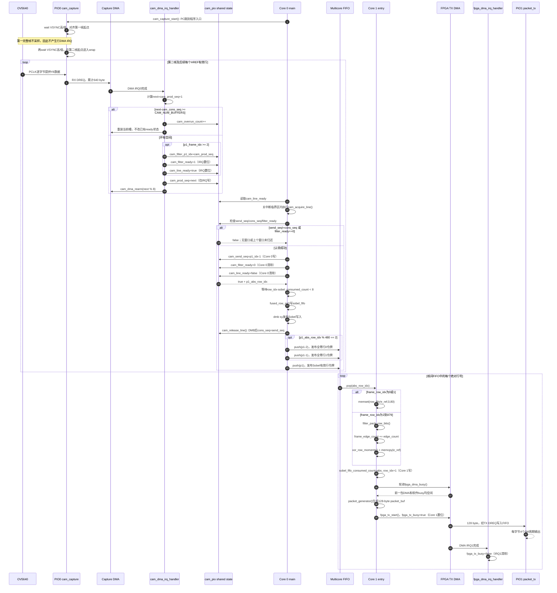
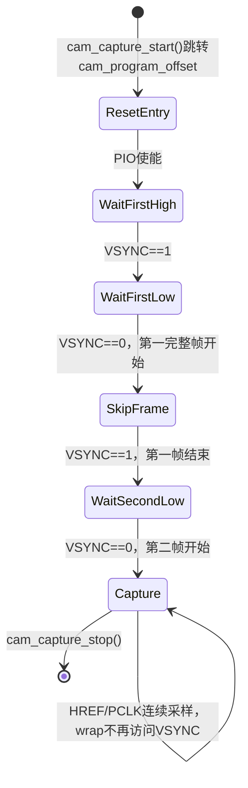
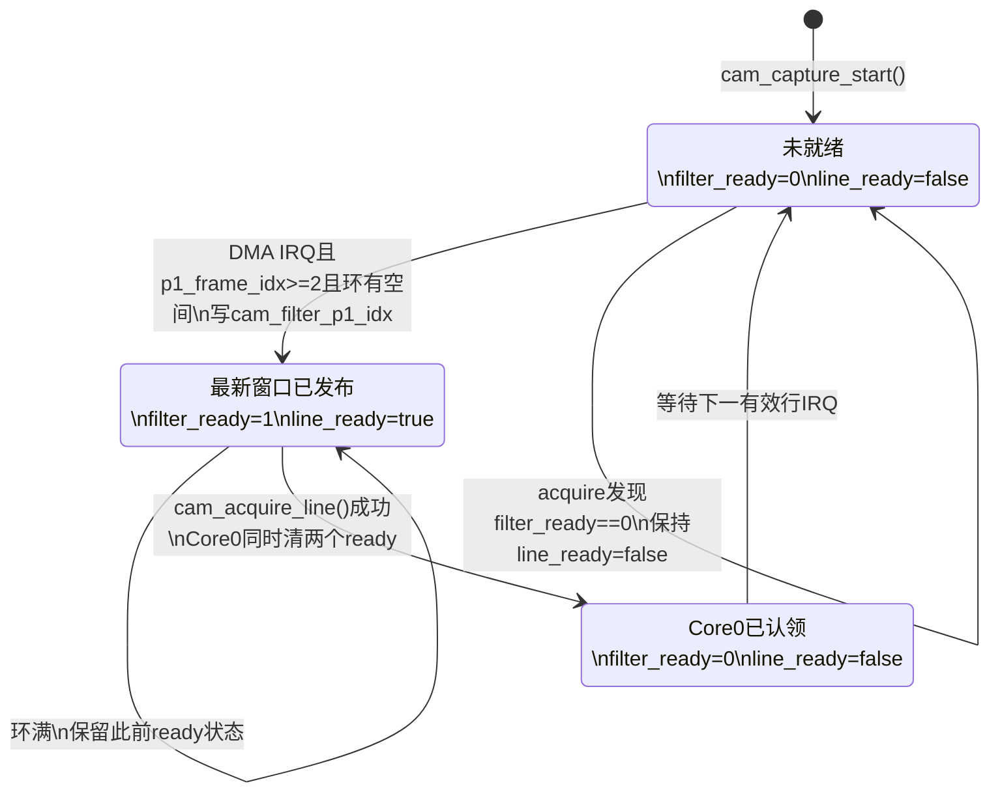
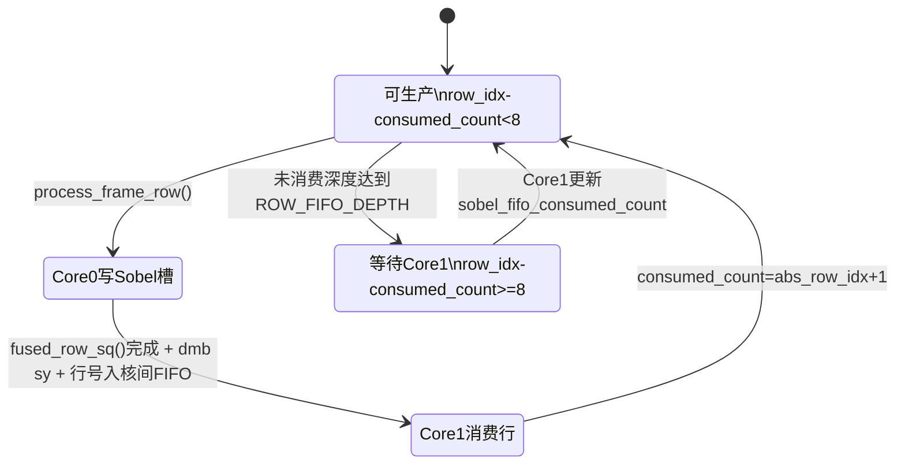
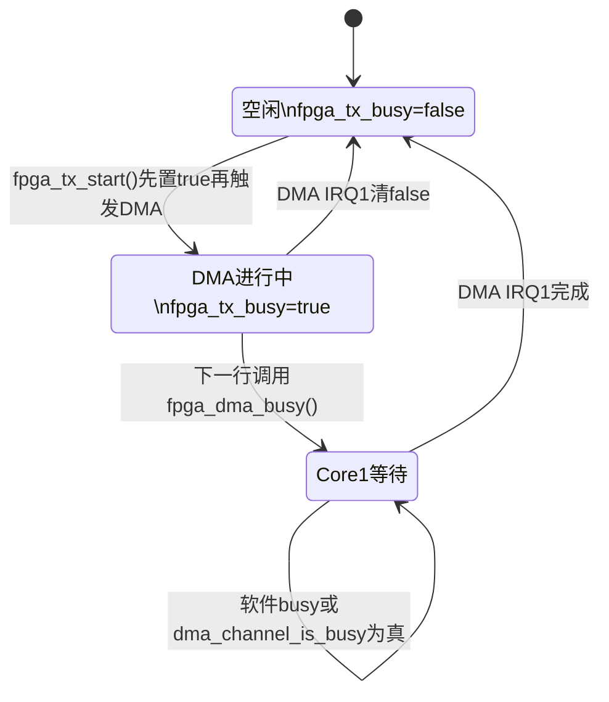
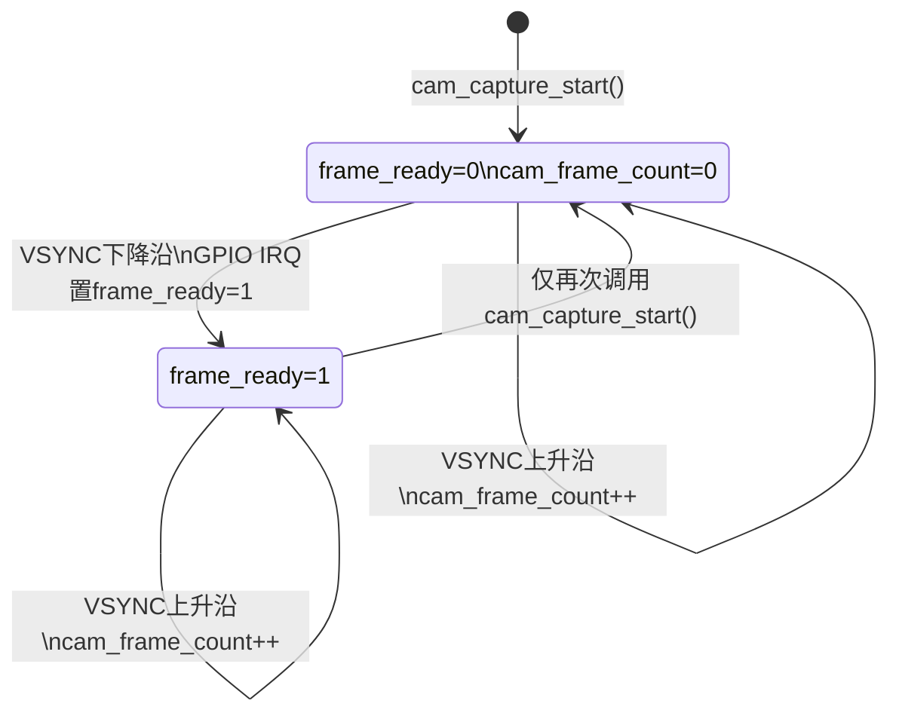
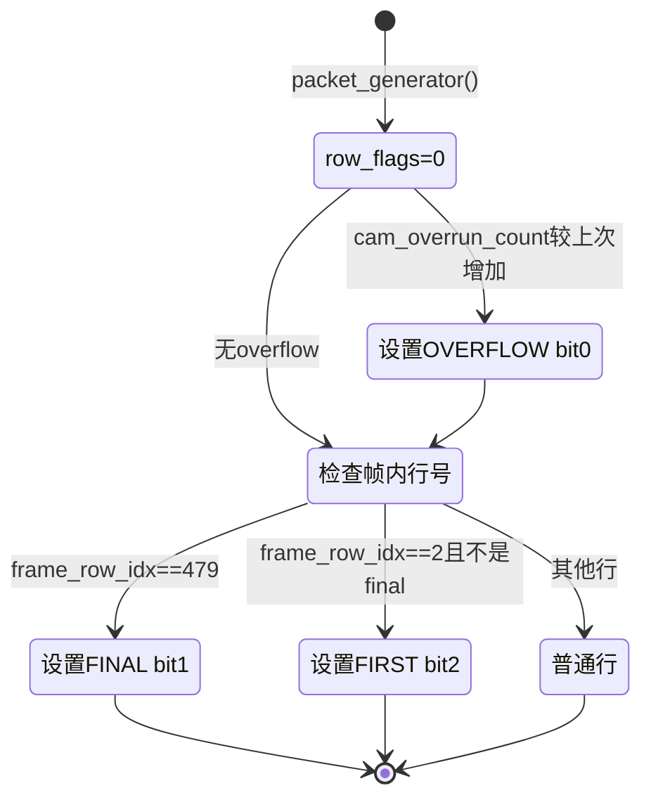

# 图像采集、处理与发送架构解析（v6）

> 生成日期：2026-07-18
> 依据范围：当前工作树中的 `cam_pio.pio`、`main.c`、`func/cam_pio.c`、`func/image_process.c`、`func/fpga_pio.c` 及其对应头文件。
> 约束：本文只描述能够从当前代码定位的实现。代码没有给出明确依据的内容统一标记为「⚠️ 待确认」。

## 1. 系统总览

当前主数据流是：OV5640 通过 8-bit DVP 输出 Y8 灰度像素；PIO0 在启动时用两组 VSYNC 等待跳过第一完整帧，从第二帧开始按 HREF/PCLK 收取像素；采集 DMA 每收到 640 byte 产生一次完成中断，并把行写入 8 槽原始行环。Core 0 通过 `cam_acquire_line()` 认领三行滑动窗口，运行 `fused_row_sq()` 生成每像素 `(gx, gy)`；随后通过 RP235x 核间硬件 FIFO 发布绝对行号。Core 1 收到行号后执行阈值平方比较、8像素定长位打包、参考帧 XOR、图像矩累计和 128-byte 组包，最后由发送 DMA 把数据送入 PIO1 TX FIFO，再以 8-bit 数据总线和时钟输出到 FPGA。

核心文件及代码职责如下。

| 文件 | 当前运行路径中的职责 | 主要代码依据 |
|---|---|---|
| `cam_pio.pio` | 启动时跳过第一帧；运行期按 HREF/PCLK 采集8-bit像素 | 第18～35行，`cam_capture` |
| `func/cam_pio.c` | PIO0/DMA初始化、原始行环、DMA IRQ发布、三行窗口认领与归还 | `cam_dma_irq_handler()`、`cam_acquire_line()`、`cam_release_line()` |
| `header/cam_pio.h` | 640×480、8槽行环及采集接口配置 | `CAPTURE_BYTES`、`CAPTURE_LINES`、`CAM_NUM_BUFFERS` |
| `main.c` | 系统初始化、Core 0行处理编排、核间行号FIFO、Core 1发送循环 | `main()`、`fpga_pio_core1_entry()` |
| `func/image_process.c` | Sobel、Threshold/bit packing、XOR/矩、参考帧、动态阈值、组包 | `fused_row_sq()`、`filter_pack_row_bits()`、`image_core1_process_row()`、`packet_generator()` |
| `header/image_process.h` | 80-byte二值行、8槽Sobel/结果环、24+80+24包格式 | `ROW_BYTES`、`ROW_FIFO_DEPTH`、`PACKET_BYTES`、三个包结构体及静态断言 |
| `func/fpga_pio.c` | 单通道发送DMA、`fpga_tx_busy`、DMA IRQ1完成处理 | `fpga_dma_init()`、`fpga_tx_start()`、`fpga_dma_irq_handler()` |
| `fpga_pio.pio` | 每字节4个SM周期的8-bit并行输出 | `packet_tx` |
| `func/ov5640.c`、`func/ov5640_set.c`、`header/ov5640_regs.h` | 传感器上电、SCCB配置、640×480 Y8及帧时序寄存器 | `ov5640_start_capture()`、`OV5640_Init()`、`ov5640_init_common[]` |
| `func/timer.c` | RP2354系统时钟144 MHz及OV5640 XCLK 24 MHz | `timer_config()`、`clock_DCMI_config()` |

### 1.1 当前数据格式与缓冲布局

| 数据层 | 格式/容量 | 代码依据 |
|---|---:|---|
| OV5640输入 | 640×480，Y8，1 byte/像素 | `main.c:82`；`CAPTURE_BYTES=640`、`CAPTURE_LINES=480` |
| 原始行环 `cam_frame_buf` | 8 × 640 byte = 5120 byte | `func/cam_pio.c:47`；`CAM_NUM_BUFFERS=8` |
| Sobel环 `sobel_fifo` | 8 × 640 × 4 byte = 20480 byte | `func/image_process.c:21`；每像素低16位`gx`、高16位`gy` |
| 二值行环 `row_fifo` | 8 × 80 byte = 640 byte | `func/image_process.c:24`；640像素按1 bit/像素打包 |
| 参考帧 `e_ref` | 480 × 80 byte = 38400 byte | `func/image_process.c:30` |
| 发送包 `packet_buf` | 128 byte | `main.c:32`；`PACKET_BYTES=128` |
| 线缆包格式 | 24-byte header + 80-byte payload + 24-byte trailer | `header/image_process.h:17-49`静态断言 |

`fused_row_sq()`写出的32-bit中间值按以下方式组装，依据是 `func/image_process.c:139-161`：低16位保存强制转换后的`gx`，高16位保存强制转换后的`gy`。Core 1通过 `__builtin_arm_smuad(pair, pair)` 同时计算两个16-bit有符号分量的平方和，见 `filter_pack_row_bits()`。

## 2. 完整数据流图

```mermaid
flowchart TD
    CAM["OV5640 DVP<br/>640x480 Y8<br/>ov5640_start_capture()<br/>func/ov5640.c"]

    subgraph CAPTURE["采集链：PIO0 + DMA IRQ0"]
        VS0["启动同步<br/>两组 wait VSYNC 高/低<br/>cam_pio.pio:18-24"]
        SKIP["第一完整帧<br/>不执行像素采样"]
        PIO0["PIO0 SM0 cam_capture<br/>HREF/PCLK + in pins,8<br/>cam_pio.pio:26-35"]
        RX["PIO0 RX FIFO<br/>8-bit autopush<br/>cam_capture_program_init()"]
        CDMA["采集DMA<br/>DMA_SIZE_8 + RX DREQ<br/>cam_dma_init()"]
        CBUF["cam_frame_buf<br/>8 x 640 byte<br/>func/cam_pio.c:47"]
        CIRQ{"cam_dma_irq_handler()<br/>环是否有空间?<br/>func/cam_pio.c:138"}
        P1CHECK{"p1_frame_idx >= 2 ?<br/>func/cam_pio.c:157"}
        DROP["cam_overrun_count++<br/>重装当前槽<br/>func/cam_pio.c:150-154"]
        PUB["p1帧内行号>=2<br/>写cam_filter_p1_idx<br/>置cam_filter_ready/cam_line_ready<br/>func/cam_pio.c:157-163"]
    end

    subgraph CORE0["Core 0：滑动窗口与Sobel"]
        POLL["轮询cam_line_ready<br/>main.c:114"]
        ACQ{"cam_acquire_line()<br/>send_seq==cons_seq 且 filter_ready<br/>func/cam_pio.c:262-286"}
        RAW["cam_get_buffer(p1-2,p1-1,p1)<br/>8槽原始行环<br/>main.c:118-121"]
        WAIT_S["Sobel环背压<br/>row_idx-consumed_count<8<br/>process_frame_row()"]
        SOBEL["fused_row_sq()<br/>4像素展开 + 3个32-bit load<br/>SRAM执行<br/>func/image_process.c:108-194"]
        SFIFO["sobel_fifo[row_idx % 8]<br/>640个32-bit pair"]
        RELEASE["cam_release_line()<br/>DMB后 cons_seq=send_seq<br/>func/cam_pio.c:289-295"]
        TOKEN{"p1 % 480 == 2 ?<br/>main.c:124-130"}
        ZERO_TOKEN["先发布行号0、1<br/>p1-2 / p1-1"]
        ROW_TOKEN["发布有效行号p1<br/>multicore_fifo_push_blocking()"]
    end

    MCFIFO["RP235x multicore FIFO<br/>仅传递uint32绝对行号"]

    subgraph CORE1["Core 1：Threshold、运动信息与组包"]
        POP["multicore_fifo_pop_blocking()<br/>fpga_pio_core1_entry()<br/>main.c:165"]
        ROWTYPE{"frame_row_idx为0或1?<br/>image_core1_process_row()"]
        WHITE["row_fifo/e_ref清零<br/>固定80 byte 0x00"]
        PACK["filter_pack_row_bits()<br/>SMUAD平方和 + Threshold<br/>8像素打包1 byte"]
        RFIFO["row_fifo[abs_row_idx % 8]<br/>80 byte"]
        XOR["xor_row_moments()<br/>与e_ref异或并累加m00/m10/m01"]
        REF["memcpy更新e_ref[frame_row_idx]"]
        CONSUME["sobel_fifo_consumed_count<br/>= abs_row_idx + 1"]
        TXWAIT["while fpga_dma_busy()<br/>保护单一packet_buf<br/>main.c:184-187"]
        PKT["packet_generator()<br/>24 + 80 + 24 = 128 byte<br/>func/image_process.c:276-333"]
        THUP["final_line时<br/>update_threshold()"]
    end

    subgraph TX["发送链：单DMA + PIO1"]
        START["fpga_tx_start(packet_buf,128)<br/>置fpga_tx_busy=true"]
        TDMA["发送DMA<br/>DMA_SIZE_8 + TX DREQ<br/>func/fpga_pio.c:71-87"]
        TXFIFO["PIO1 SM0 TX FIFO"]
        PIO1["packet_tx<br/>8-bit data + sideset clock<br/>fpga_pio.pio:15-20"]
        FPGA["外部FPGA接收端"]
        TIRQ["DMA IRQ1<br/>fpga_tx_busy=false<br/>fpga_dma_irq_handler()"]
    end

    CAM --> VS0
    VS0 --> SKIP
    SKIP -->|"第二次VSYNC下降沿"| PIO0
    PIO0 --> RX --> CDMA --> CBUF --> CIRQ
    CIRQ -->|"next-cons >= 8"| DROP
    DROP --> CDMA
    CIRQ -->|"有空间"| P1CHECK
    P1CHECK -->|"否：行0/1，只推进prod并重装DMA"| CDMA
    P1CHECK -->|"是"| PUB
    PUB -->|"同时推进prod并重装下一DMA槽"| CDMA
    PUB --> POLL --> ACQ
    ACQ -->|"false"| POLL
    ACQ -->|"true"| RAW --> WAIT_S --> SOBEL --> SFIFO
    SOBEL --> RELEASE --> TOKEN
    TOKEN -->|"是"| ZERO_TOKEN --> MCFIFO
    TOKEN -->|"否"| ROW_TOKEN --> MCFIFO
    ZERO_TOKEN --> ROW_TOKEN
    MCFIFO --> POP --> ROWTYPE
    ROWTYPE -->|"是"| WHITE
    ROWTYPE -->|"否"| PACK --> RFIFO --> XOR --> REF
    SFIFO -. "按abs_row_idx % 8读取" .-> PACK
    WHITE --> CONSUME
    REF --> CONSUME
    CONSUME --> TXWAIT --> PKT
    PKT -->|"frame_row_idx==479"| THUP
    PKT --> START
    THUP --> START
    START --> TDMA --> TXFIFO --> PIO1 --> FPGA
    TDMA --> TIRQ
```

图中采集发布条件来自 `cam_dma_irq_handler()`：只有 `p1_frame_idx >= 2` 才能形成 `[p1-2,p1-1,p1]` 三行窗口。Core 0每帧因此只运行478次Sobel（p1=2…479），但在p1=2时额外向核间FIFO发布行号0和1；Core 1针对这两个行号走清零分支，从而仍生成480个行包。发送侧当前只有 `fpga_dma_chan` 一个DMA通道，代码中没有第二发送DMA或软件发送队列。

VSYNC还有一条独立CPU中断支路：`cam_gpio_irq_callback()`在上升沿递增`cam_frame_count`、下降沿置`frame_ready=1`，但它不启动、停止或重装采集DMA。该支路没有放进主像素流连线，因为当前`main.c`没有读取`frame_ready`；详见第6节的「⚠️ 待确认」。

## 3. 双核协作时序图



跨核数据不是像素指针，而是一个`uint32_t abs_row_idx`令牌。Sobel数据和二值行分别留在共享静态环中，通过`abs_row_idx % ROW_FIFO_DEPTH`选槽。Core 0在写完Sobel后执行`dmb sy`，Core 1消费完成后推进`sobel_fifo_consumed_count`。原始相机行环的归还只依赖Core 0完成Sobel读取：`cam_release_line()`在核间FIFO发布和FPGA发送之前调用，因此当前代码不存在“必须等FPGA DMA完成才释放原始行缓冲”的直接依赖。

`multicore_fifo_push_blocking()`只保证令牌进入核间FIFO以及FIFO顺序，不代表对应FPGA DMA已经完成。实际发送串行化由Core 1的`while (fpga_dma_busy())`保证。

### 3.1 标志位和计数器写入归属

| 状态量 | 声明位置 | 写入方 | 读取方 | 当前语义 |
|---|---|---|---|---|
| `cam_prod_seq` | `func/cam_pio.c:59` | 仅采集DMA IRQ；启动时Core 0清零 | DMA IRQ | 已完成并纳入行环的绝对行数；同时决定下一DMA槽 |
| `cam_filter_p1_idx` | `func/cam_pio.c:67` | 采集DMA IRQ；启动时清零 | `cam_acquire_line()` | 最新可形成三行窗口的末行绝对序号p1 |
| `cam_filter_ready` | `func/cam_pio.c:68` | DMA IRQ置1；`cam_acquire_line()`清0；启动时清0 | `cam_acquire_line()` | 内部窗口有效标志 |
| `cam_line_ready` | `func/cam_pio.c:66` | DMA IRQ置true；`cam_acquire_line()`清false；启动时清false | `main()`、`cam_acquire_line()` | 对Core 0公开的快速行就绪标志 |
| `cam_send_seq` | `func/cam_pio.c:60` | `cam_acquire_line()`；启动时清零 | acquire/release | 当前被Core 0认领窗口可释放到的位置，即`p1-1` |
| `cam_cons_seq` | `func/cam_pio.c:61` | `cam_release_line()`；启动时清零 | DMA IRQ、acquire/release | 已允许采集DMA复用的消费位置 |
| `sobel_fifo_consumed_count` | `func/image_process.c:27` | Core 1的`image_core1_process_row()` | Core 0的`process_frame_row()` | Core 1已消费到的绝对行位置 |
| `fpga_tx_busy` | `func/fpga_pio.c:26` | `fpga_tx_start()`置true；DMA IRQ1清false | Core 1的`fpga_dma_busy()` | 单一发送DMA的软件忙标志 |
| `cam_overrun_count` | `func/cam_pio.c:64` | 采集DMA IRQ递增；启动时清零 | Core 1 | 原始行环追上消费者的累计次数 |
| `frame_ready` | `func/cam_pio.c:63` | VSYNC下降沿置1；启动时清零 | 当前主路径无读取者 | 设计注释称供IMU按帧触发，但当前未接入 |
| `cam_frame_count` | `func/cam_pio.c:65` | VSYNC上升沿递增；启动时清零 | 当前主路径无读取者 | CPU侧VSYNC边界计数，不参与包内`frame_id` |
| `row_flags` | `pkt_row_header_t` | Core 1的`packet_generator()` | FPGA接收端 | overflow/final/first三个包内bit |

## 4. 状态机图

### 4.1 PIO启动跳过第一帧状态机



代码依据是 `cam_pio.pio:18-35` 和 `cam_capture_start()`中的 `pio_sm_exec(...jmp(cam_program_offset))`。四条VSYNC等待位于`.wrap_target`之前，所以只在启动/重启时执行；进入`Capture`后没有返回VSYNC等待的跳转。

### 4.2 `cam_filter_ready`与`cam_line_ready`



两者在当前赋值路径中同时置位、同时清除；额外的`cam_filter_ready==0`失败分支只会再次清`cam_line_ready`。因此当前代码提供了“完全同步”的直接证据，但本文不据此删除或改名。需要注意，`cam_filter_p1_idx`是单槽“最新值”而不是FIFO：Core 0未及时认领时，新DMA IRQ会覆盖旧p1，见图中的`Ready --> Ready`。

### 4.3 原始行环所有权：`cam_prod_seq/cam_send_seq/cam_cons_seq`

```mermaid
stateDiagram-v2
    state "空闲\nsend_seq==cons_seq" as Idle
    state "窗口被Core0认领\nsend_seq=p1-1\nsend_seq!=cons_seq" as Owned
    state "旧行可复用\ncons_seq=send_seq" as Released
    state "原始行环满" as Full

    [*] --> Idle: cam_capture_start()三者清零
    Idle --> Idle: DMA IRQ有空间\nprod_seq++
    Idle --> Owned: cam_acquire_line()成功
    Owned --> Released: Sobel读取结束后cam_release_line()\nDMB; cons_seq=send_seq
    Released --> Idle: 不变式恢复
    Idle --> Full: next-cons_seq>=CAM_NUM_BUFFERS
    Owned --> Full: next-cons_seq>=CAM_NUM_BUFFERS
    Full --> Full: overrun_count++并重装同一槽
    Full --> Idle: Core0认领并release旧窗口后出现空间
```



`cam_send_seq=p1_idx-1`不是DMA生产次数；它表示三行窗口完成Sobel读取后，`p1-2`及更早行可以被复用，同时保留`p1-1`和`p1`给下一滑动窗口。依据为 `cam_acquire_line():279-282` 与 `cam_release_line():289-295`。

### 4.4 Sobel共享环与消费计数器



该状态机依据 `process_frame_row():344-355` 和 `image_core1_process_row():415-416`。行0、1虽然不读取`sobel_fifo`，Core 1仍会推进消费计数器；这是当前白边令牌与绝对行号连续性的代码行为。

### 4.5 `fpga_tx_busy`



状态的唯一运行期置位方是Core 1调用的`fpga_tx_start()`，唯一清除方是`fpga_dma_irq_handler()`。`fpga_dma_busy()`还同时读取DMA硬件busy位，因此即使IRQ清标志时序靠近轮询边界，Core 1仍会检查通道状态。

### 4.6 VSYNC记账状态：`frame_ready/cam_frame_count`



当前运行路径中找不到清除`frame_ready`的消费者，也找不到`cam_frame_count`的读取者。PIO会跳过第一帧，但CPU VSYNC IRQ仍会对该帧记账；包内`frame_id`则来自`abs_row_idx / 480`。因此这两套帧编号是否需要对齐属于「⚠️ 待确认」。

### 4.7 包内行标志 `row_flags`



`has_overflow/is_first_line/is_final_line`在 `main.c:168-171`由绝对行号和`cam_overrun_count`派生；`packet_generator():286-294`将它们写入包头。当前FIRST标志落在行2，而实际发送序列从全零行0开始，这表示“第一条Sobel有效行”，是否也是FPGA协议定义的“帧首包”需要确认。

## 5. 关键路径耗时表

当前系统时钟是144 MHz，依据 `func/timer.c:10` 和 `timer_config()`中的PLL配置，因此表中使用 `cycles = us × 144` 换算。实测数据来自本轮调试时用户提供的逻辑分析仪/GPIO结果；理论值按代码常量计算，两者不混用。

| 阶段 | 当前耗时/预算 | 144 MHz折算 | 类型与来源 | 测量边界说明 |
|---|---:|---:|---|---|
| Core 0 Sobel：`fused_row_sq()` | `< 80 us/行` | `< 11520 cycles` | **实测**：本轮用户提供 | 当前`fused_row_sq()`即Sobel主体；纯函数边界的最新探针位置需与测试固件复核 |
| Threshold及打包：当前对应`filter_pack_row_bits()` | 约`70 us/行`，后续描述为`<80 us` | 约`10080 cycles` | **实测**：用户早期与本轮数据 | 当前代码已经没有`threshold_row_sq()`符号；历史测量名与当前函数边界是否完全一致为「⚠️ 待确认」 |
| Core 0 + Core 1行级软件总路径 | 约`125 us/行` | 约`18000 cycles` | **实测**：用户提供 | 是否包含Core 1的`fpga_dma_busy()`等待需要结合GPIO8窗口确认 |
| 单行稳态预算 | 约`128 us/行` | 约`18432 cycles` | **理论估算**：用户给定的FPS/时钟预算 | 余量约3 us；无法吸收持续等待或明显抖动 |
| OV5640完整行周期 | `1562 / 12 MHz = 130.17 us` | 不适用 | **理论估算**：`ov5640_regs.h:782-786` | HTS=1562，PCLK注释为12 MHz |
| OV5640理论帧周期 | `1562×512 / 12 MHz = 66.65 ms`，约15.006 fps | 不适用 | **理论估算**：`ov5640_regs.h:782-786` | 不代表逻辑分析仪实测FPS |
| 128-byte包的PIO纯输出时间 | `128 / 24 MB/s = 5.33 us` | PIO SM约512周期 | **理论估算**：`fpga_pio.c:57`、`fpga_pio.pio:15-20` | 不含Core 1组包、DMA配置、FIFO起停和前包busy等待 |

GPIO探针的当前代码边界如下：GPIO9在`main.c:116-131`覆盖 `process_frame_row()`、`cam_release_line()`以及一到三次`multicore_fifo_push_blocking()`；GPIO8在`main.c:173-192`覆盖 Core 1处理、等待上一发送DMA、组包和启动新DMA。由此，GPIO9/8高电平不能分别直接等同于纯Sobel/纯Threshold函数时间。

## 6. 已知限制与待办

### 6.1 当前架构中的「⚠️ 待确认」

1. **运行期帧边界不再由VSYNC纠偏。** `cam_pio.pio`进入`.wrap_target`后只检查HREF/PCLK；`cam_prod_seq % 480`成为软件帧内行号来源。如果运行期出现多一次或少一次HREF，后续逻辑帧边界会漂移，直到重新调用`cam_capture_start()`。当前代码没有运行期重同步路径。

2. **跳过第一帧只阻止PIO像素采样，不阻止CPU VSYNC记账。** `cam_frame_count`会包含被跳过帧，而包内`frame_id`从DMA绝对行号计算。两者当前互不影响，但若后续IMU重新使用`frame_ready/cam_frame_count`，需要定义对齐关系。

3. **`frame_ready`没有运行期清除方。** `cam_gpio_irq_callback()`在每个VSYNC下降沿写1，当前`main.c`没有IMU采样或清零逻辑。头文件所写“供IMU按帧采样”尚未在主路径实现。

4. **`cam_filter_p1_idx`是单槽最新值。** DMA IRQ可在`cam_filter_ready`尚未被Core 0清除时覆盖p1，因而不是逐行排队。如果Core 0暂时落后但原始环尚未判满，中间窗口可能不会逐个进入Sobel链。是否允许这种“取最新窗口”语义需要确认。

5. **FIRST标志当前落在行2。** 行0、1是实际发送的两个全零包，`is_first_line`却在`frame_row_idx==2`时为真。需要由FPGA协议确认FIRST表示“帧第一个包”还是“第一条有效Sobel行”。

6. **CRC由FPGA计算的接口契约没有代码外证据。** `packet_generator()`固定写`trailer->crc16=0xFFFF`，虽然`crc16_ccitt()`仍存在，但当前不调用。FPGA端确实以`0xFFFF`为占位并重新计算这一行为「⚠️ 待确认」。

7. **发送链只有单DMA。** `func/fpga_pio.c`只有一个`fpga_dma_chan`，下一包通过`fpga_dma_busy()`等待前包完成。README顶部仍写“双DMA/队列式机制”，与当前代码不一致；7/18更新记录会明确当前实际结构。

8. **`fpga_tx_stop()`仍为空函数。** 当前没有停止发送DMA、清FIFO或复位`fpga_tx_busy`的实现；若运行期调用，行为不与`fpga_tx_start()`对称。

9. **PIO发送注释中的引脚号过期。** `fpga_pio.pio`注释写GPIO8，实际`FPGA_CLK_PIN`是GPIO23；GPIO8由`main.c`用作Core 1计时探针。生成配置使用宏，因此运行代码走GPIO23，但注释需要后续确认后统一。

10. **长期稳定性数据尚未落盘。** 当前工作树没有连续≥500行的`cam_overrun_count`、核间FIFO积压或Sobel未消费深度曲线，无法仅凭代码证明125 us路径在约128 us预算下长期收敛。

### 6.2 上一轮清理后仍未解决的用途不明/未接入项

| 项目 | 当前代码证据 | Git历史/上下文可追溯结果 | 结论 |
|---|---|---|---|
| `CAM_DEBUG_PIN` | `header/cam_pio.h:37`定义GPIO9并注释为“DMA完成中断调试输出”，但采集IRQ没有使用；`main.c`直接写常量9作为Core 0探针 | 可追溯到`0110ddb`的引脚清理提交，但当前用途已经不同 | **用途冲突，⚠️ 待确认后再处理** |
| `FPGA_CTRL_PIN`条件块 | `func/fpga_pio.c:42-46`存在`#ifdef`，工程内没有该宏定义 | 可追溯到旧发送模块提交，当前没有协议或引脚说明 | **用途不明，⚠️ 待确认后再处理** |
| `CAPTURE_WORDS` | `header/cam_pio.h:43`定义为160，工程无读取；当前采集DMA使用`DMA_SIZE_8`和`CAPTURE_BYTES` | 来自初始采集接口，无法在当前运行路径找到作用 | **未使用，⚠️ 待确认后再处理** |
| `cam_enable_4x4_scaffold()`及两个4x4宏 | 函数体只有TODO注释，且无调用 | `0110ddb`明确标为未来16行块预留 | **用途已知但未实现；不属于当前架构** |
| `debug_gpio_init()` | `func/image_process.c:44-49`存在但无调用；`main.c`另有`core1_timing_gpio_init()` | 7/16图像处理调试遗留 | **未接入，是否保留待确认** |
| `rle_encode_row()` | 仅逐字节复制，且当前`packet_generator()`直接`memcpy`，无调用 | 函数注释明确说明是RLE占位 | **用途已知但未实现；不属于当前发送路径** |
| `static uint16_t frame_id` | `func/image_process.c:34`声明并在初始化时清零，包内帧号实际使用`frame_id_in` | 当前无其他读写 | **未使用，是否保留待确认** |

## 7. 图表连线与状态转换自查

按验收要求抽查以下三处；均能够从当前代码直接定位。

1. **PIO跳过第一帧 → 第二帧开始采样**：`cam_pio.pio:18-24`有两组`wait 1/0 gpio VSYNC`，`.wrap_target`从第26行开始；`func/cam_pio.c:218-224`在启动时把PC跳回程序入口。

2. **采集DMA完成 → 发布三行窗口 → Core 0清ready**：`func/cam_pio.c:147-163`计算p1、写`cam_filter_p1_idx`并置两个ready；`func/cam_pio.c:268-286`在关中断临界区读取p1并清两个ready。

3. **Core 1组包 → 发送DMA → IRQ清busy**：`main.c:184-190`等待DMA、调用`packet_generator()`和`fpga_tx_start()`；`func/fpga_pio.c:107-111`置`fpga_tx_busy=true`并启动DMA；`func/fpga_pio.c:91-100`在IRQ1中清false。

额外核对：包大小静态断言位于`header/image_process.h:43-49`；行0/1白边分支位于`func/image_process.c:399-403`；行2到479的发布条件位于`func/cam_pio.c:145-163`和`main.c:124-130`。
